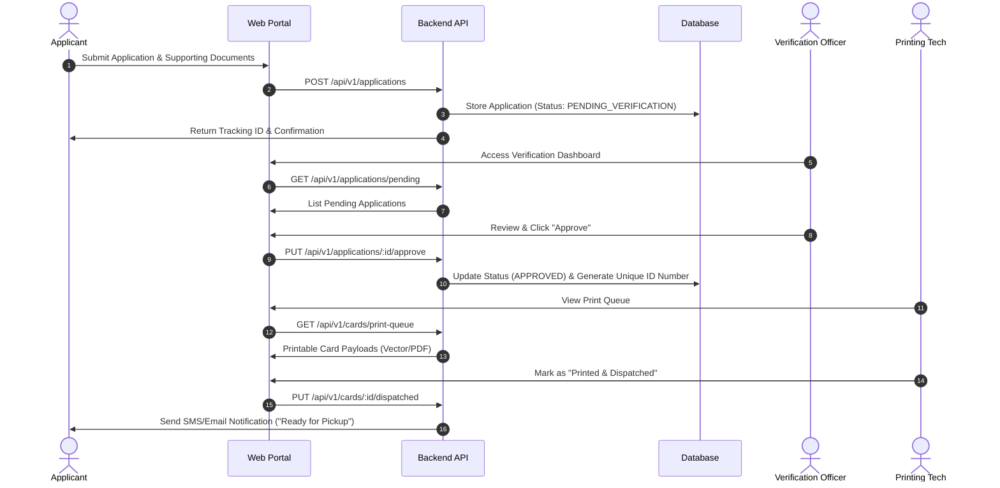

# 🆔 Smart Identity Card Issuing System

[](https://github.com)
[](https://opensource.org/licenses/MIT)
[](http://makeapullrequest.com)
[](https://github.com)
[](https://github.com)

---

> **SE_PROJECT --- IDENTITY_CARD_ISSUING_PROJECT**  
> An end-to-end, enterprise-grade digital solution designed to streamline, automate, and secure the national/institutional identity card application, verification, approval, generation, and distribution lifecycle.

---

## 📑 Table of Contents

- [Overview](#-overview)
- [Key Features](#-key-features)
- [System Architecture](#-system-architecture)
- [Tech Stack](#-tech-stack)
- [UI & Application Gallery](#-ui--application-gallery)
- [Workflow & Process Lifecycle](#-workflow--process-lifecycle)
- [Getting Started](#-getting-started)
  - [Prerequisites](#prerequisites)
  - [Installation](#installation)
  - [Environment Configuration](#environment-configuration)
  - [Database Setup](#database-setup)
- [API Documentation](#-api-documentation)
- [Role-Based Access Control (RBAC)](#-role-based-access-control-rbac)
- [Testing & Quality Assurance](#-testing--quality-assurance)
- [Contributing](#-contributing)
- [License & Acknowledgments](#-license--acknowledgments)

---

## 🔬 Overview

The ** Web-Based Identity Card Issuing System ** addresses the operational bottlenecks, paper-heavy workflows, and security risks associated with manual identity card management. Built as part of the Software Engineering curriculum, this project provides a scalable, role-governed platform capable of handling citizen/student identity registration, biometric & document validation, automated unique national ID (NID/GUID) generation, QR/barcode encoding, high-throughput card print queuing, and audit logging.

```
                                         +----------------------------------------------+
                                         |           Smart Identity Card System         |
                                         +----------------------------------------------+
                                                               |
         +----------------------+-------------------+----------------------+--------------------+-------------------+
         |                      |                   |                      |                    |                   |
+--------+-------+     +--------+-------+   +-------+---------+   +--------+--------+   +-------+-------+   +-------+-------+
| Citizen        |     | ID Application |   | Document        |   | Approal & Issue |   | Admin & Audit |   | Operations    |
| Management     |     | Management     |   | Management      |   | Management      |   | Management    |   | Management    |
+----------------+     +----------------+   +-----------------+   +-----------------+   +-------+-------+   +-------+-------+
```

---

## ⚡ Key Features

* 📝 **Citizen Online Registration Portal:** Intuitive, step-by-step form wizard for personal details, biometric/photo upload, and supporting document attachments.


* 🔍 **Multi-Tier Verification Workflow:** Administrative dashboards for data verification, background checks, document verification, and one-click approvals/rejections.


* 🆔 **Automated Unique ID & Smart Code Generation:** Cryptographically secure unique identification numbers with integrated 2D QR codes and PDF417 barcodes storing encrypted identity payloads.


* 🖨️ **Print Queue Management System:** Automated batch processing for thermal/PVC ID printers, exportable print-ready PDF/vector formats, and card dispatch tracking.


* 🔐 **Strict Role-Based Access Control (RBAC):** Hierarchical permissions governing Applicant, Data Entry Clerk, Verification Officer, Super Administrator, and Printing Technician roles.


* 📊 **Real-Time Analytics & Reporting:** Graphical breakdown of application statuses, average processing turnaround time (TAT), regional distribution, and audit trails.


* 🔔 **Automated Notifications:** SMS and email integration (Twilio/SendGrid) for application status updates and card pickup notifications.

---

## 🛠️ System Architecture

```
                                    +-----------------------+
                                    |     Client Layer      |
                                    | (React / Web Portal)  |
                                    +-----------+-----------+
                                                |
                                                v [HTTPS / REST API]
                                                |
                                    +-----------+-----------+
                                    |   API Gateway / Node  |
                                    +-----------+-----------+
                                                |
                   +----------------------------+----------------------------+
                   |                            |                            |
                   v                            v                            v
        +-------------------+        +--------------------+        +-------------------+
        |  Auth Service     |        | Application Engine |        | Biometric/Media   |
        |  (JWT / OAuth2)   |        | (Business Logic)   |        | Storage (S3)      |
        +---------+---------+        +----------+---------+        +-------------------+
                  |                             |
                  +--------------+--------------+
                                 |
                                 v
                     +-----------------------+
                     |  PostgreSQL Database  |
                     +-----------------------+
```

---

## 🛠️ Tech Stack

### Frontend

)
)
### Backend


### Database & Storage
)

### DevOps & Tools


---

## 🖼️ UI & Application Gallery

Below are visual previews of the key modules in the Identity Card Issuing System:

|                                                            **Applicant Registration Dashboard**                                                             | **Verification Officer Portal** |
|:-----------------------------------------------------------------------------------------------------------------------------------------------------------:| :---: |
|  |  |
|                                                     *Step-by-step citizen identity submission portal.*                                                      | *Review submitted documents, biometrics, and approve.* |

|                                                    **Digital Identity Card Front & Back Preview**                                                     |                                                          **Batch Print Queue & System Analytics**                                                           |
|:-----------------------------------------------------------------------------------------------------------------------------------------------------:|:-----------------------------------------------------------------------------------------------------------------------------------------------------------:|
|  |  |
|                                                  *Auto-generated PVC printable layout with QR code.*                                                  |                                                   *Real-time statistics on card issuing & print status.*                                                    |

---

## 🔄 Workflow & Process Lifecycle

> 
> The lifecycle guarantees multi-tier validation before any physical card enters the print queue.



---

## 🚀 Getting Started

Follow these instructions to get a local copy of the project up and running for development and testing.

### Prerequisites

Ensure you have the following installed on your machine:
* **Node.js**  : v18.x or higher
* **npm**: v9.x or higher (or `pnpm` / `yarn`)
* **PostgreSQL**: v14.x or higher
* **Docker & Docker Compose** (Optional, but recommended)

---

### Installation

1. **Clone the Repository:**
   ```bash
   git clone https://github.com/your-org/SE_PROJECT---IDENTITY_CARD_ISSUING_PROJECT.git
   cd SE_PROJECT---IDENTITY_CARD_ISSUING_PROJECT
   ```

2. **Install Backend Dependencies:**
   ```bash
   cd <Directory>
   npm install
   ```

3. **Install Frontend Dependencies:**
   ```bash
   cd <Directory>
   ```
   ```bash
   npm install
   ```
   ```bash
   npm start
   ```
   ```bash
   npm run
   ```
   ```bash
   npm run dev
   ```

---

### Environment Configuration

Create a `.env` file in the root of the `backend` directory based on `.env.example`:

```env
# Server Configuration
PORT=5000
NODE_ENV=development

# Database Configuration
DB_HOST=localhost
DB_PORT=5432
DB_USER=postgres
DB_PASSWORD=yourpassword
DB_NAME=icis_db

# Security & Authentication
JWT_SECRET=super_secret_jwt_key_change_me_in_production
JWT_EXPIRES_IN=1d

# File Storage (AWS S3 or Local Uploads)
STORAGE_TYPE=local
UPLOAD_DIR=./uploads

# SMS & Mail Gateway
SMTP_HOST=smtp.mailtrap.io
SMTP_PORT=2525
SMTP_USER=your_user
SMTP_PASS=your_password
```

---

### Database Setup

Run database migrations and seed default administrative user accounts:

```bash
cd backend
npm run db:migrate
npm run db:seed
```

---

### Running the Application

#### Option A: Running with Docker (Recommended)

To run the entire system (Frontend, Backend, Database) using Docker Compose:

```bash
docker-compose up --build
```

Access the frontend at `http://localhost:3000` and API server at `http://localhost:5000`.

#### Option B: Running Manually

1. **Start Backend Server:**
   ```bash
   cd backend
   npm run dev
   ```

2. **Start Frontend Server:**
   ```bash
   cd frontend
   npm run dev
   ```

---

## 📡 API Documentation

The project includes an integrated Swagger UI for testing REST API endpoints.  
Once the backend server is running, visit: `http://localhost:5000/api-docs`

| Method | Endpoint | Description | Access Level |
| :--- | :--- | :--- | :--- |
| `POST` | `/api/v1/auth/login` | User authentication & JWT issuance | Public |
| `POST` | `/api/v1/applications` | Create new ID card application | Citizen / User |
| `GET` | `/api/v1/applications` | List applications with pagination & filters | Verification Officer |
| `GET` | `/api/v1/applications/:id` | Fetch detailed single application | Officer / Admin |
| `PUT` | `/api/v1/applications/:id/status` | Update approval status (Approve/Reject) | Verification Officer |
| `GET` | `/api/v1/cards/print-queue` | Fetch cards ready for batch printing | Print Technician |
| `POST` | `/api/v1/cards/:id/generate-pdf` | Render printable vector/PDF card file | Print Technician |

---

## 🛡️ Role-Based Access Control (RBAC)

The system enforces granular authorization matrices:

```
+---------------------+-------------------+---------------------+------------------+
| Permission / Action | Citizen / Public  | Verification Officer| Print Technician |
+---------------------+-------------------+---------------------+------------------+
| Submit Application  |        ✅         |          ❌         |        ❌        |
| Check Application   |     ✅ (Own)      |          ✅         |        ❌        |
| Approve / Reject    |        ❌         |          ✅         |        ❌        |
| Print Queue Access  |        ❌         |          ❌         |        ✅        |
| User Management     |        ❌         |          ❌         |        ❌        |
+---------------------+-------------------+---------------------+------------------+
```

---

## 🧪 Testing & Quality Assurance

Run test suites to ensure code quality and system reliability:

```bash
# Run unit tests in backend
cd backend
npm run test

# Run end-to-end (E2E) tests
npm run test:e2e

# Generate code coverage report
npm run test:coverage
```

---

## 🤝 Contributing

Contributions make the open-source community an incredible place to learn, inspire, and create. Any contributions you make are **greatly appreciated**.

1. Fork the Project
2. Create your Feature Branch (`git checkout -b feature/AmazingFeature`)
3. Commit your Changes (`git commit -m 'Add some AmazingFeature'`)
4. Push to the Branch (`git push origin feature/AmazingFeature`)
5. Open a Pull Request

---

## 📜 License & Acknowledgments

Distributed under the MIT License. See `LICENSE` for more information.

### Team Members & Contributors
- **Project Lead / Full-Stack Developer:** Software Engineering Team
- **Database Administrator & Security Specialist:** SE Department
- **UI/UX Designer & QA Engineer:** SE Department

---
### 🙎🏻Team members
- **IT25102040** - Nimesh K. G. N. -------------> Identity Approval & Issuance Workflow
- **IT25102993** - Sakalasooriya S. A. T. S. --> Admin & Audit Management
- **IT25200818** - Ranathunga K. A. L. D. ----> User and applicant manager
- **IT25102186** - Weerasena K. W. D. --------> Document upload & verification
- **IT25300026** - Thilakarathna K. K. R. V. ---> Identity Application Manager
- **IT25101186** - Sulakshana N. V. B. U. ------> Operational Manager
---

<p align="center">
  Designed & Developed by 2026-Y2-S1-MLB-B1G2-03 Team Members for the <b>Software Engineering Project</b>
</p>
