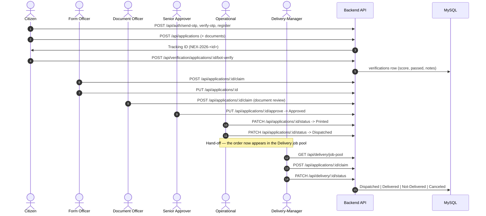

# NexusGov — Smart Identity Card Issuing System

> **SE_PROJECT — IDENTITY_CARD_ISSUING_PROJECT**
> An end-to-end web application for the citizen identity card lifecycle: online application, document handling, automated verification, approval, card printing, dispatch, and last-mile delivery tracking.

---

## Table of Contents

- [Overview](#overview)
- [Key Features](#key-features)
- [System Architecture](#system-architecture)
- [Tech Stack](#tech-stack)
- [Application Workflow](#application-workflow)
- [Getting Started](#getting-started)
  - [Prerequisites](#prerequisites)
  - [Installation](#installation)
  - [Environment Configuration](#environment-configuration)
  - [Database Setup](#database-setup)
  - [Running the Application](#running-the-application)
- [Default Credentials](#default-credentials)
- [Application Routes](#application-routes)
- [REST API Reference](#rest-api-reference)
- [Role-Based Access Control](#role-based-access-control)
- [Data Model](#data-model)
- [Repository Layout](#repository-layout)
- [Known Limitations](#known-limitations)
- [Team Members](#team-members)

---

## Overview

**NexusGov** is a role-governed identity card issuing platform built for the Software Engineering project. It covers the full pipeline from citizen submission through to a confirmed delivery outcome:

```
                          CITIZEN SUBMITS APPLICATION
                                       |
                                       v
  +------------------+     +-------------------+     +------------------+
  | Form Officer     |---->| Document Officer  |---->| Senior Approver  |
  | Job Pool         |     | Job Pool          |     | Job Pool         |
  +------------------+     +-------------------+     +------------------+
      claim / edit           claim / review           claim / approve
                                                                  |
                                                                  v
  +------------------+     +-------------------+
  | Delivery-Manager |<----| Operational       |
  | Job Pool         |     | Print Queue       |
  +------------------+     +-------------------+
   set delivery status       print & dispatch
   Delivered / Not-Delivered / Canceled

  Admin sits outside this pipeline, with oversight of users, roles, audit logs
  and account-deletion requests across all stages.
```

Every staff role except Admin works from its own **Job Pool**: a shared queue of unclaimed jobs that staff claim into a personal workbench, act on, and release back to the queue. Applications flow strictly left to right — once Operational pushes an order out, it leaves the print queue and enters the Delivery-Manager pool, where its delivery outcome is recorded.

---

## Key Features

- **Citizen Online Application Portal** — multi-step form wizard capturing personal details, service type (Normal / 1-Day), photo, and supporting document attachments.

- **OTP-Verified Registration** — new citizens confirm ownership of their email address with a 6-digit OTP sent over Gmail SMTP before the account is created.

- **Multi-Tier Verification Workflow** — three separate job pools (Form Officer, Document Officer, Senior Approver), each with claim / release semantics and independent dashboards.

- **Automated Bot Verification** — parses the uploaded birth-certificate PDF and scores the application across name, date-of-birth, gender, document authenticity, and location signals. Weighted score, pass threshold, and human-readable reasoning are persisted to a `verifications` table.

- **12-Digit NIC Generation** — generates the official Sri Lankan NIC format (`YYYY DDD SSSS C`) with day-of-year encoding, female +500 offset, and modulo-10 check digit.

- **Print Queue Management** — Operational staff move approved applications through *Awaiting Print → Printed & Ready → Dispatched*, with a 3D PVC card preview for visual confirmation before printing.

- **Delivery Management** — once Operational pushes an order out, it lands in the Delivery-Manager job pool where delivery status is tracked as `Dispatched`, `Delivered`, `Not-Delivered`, or `Canceled`.

- **Dispatch Records** — every dispatch stores tracking ID, dispatch channel (Courier / Postal), delivery address, dispatching officer, and timestamp in an append-only `dispatch_records` table.

- **Strict Role-Based Access Control** — seven roles enforced server-side by middleware on every mutating route.

- **Audit Logging** — job claims, releases, status transitions, approvals, and account-deletion decisions are all written to `audit_logs` with the acting user.

- **Automated Database Backup** — any `INSERT` / `UPDATE` / `DELETE` / `ALTER` triggers an automatic backup to `backup/database_backup.json` and `.sql`.

- **Graceful Degradation** — if MySQL is unreachable the server transparently falls back to an in-memory dataset so the UI remains demonstrable.

---

## System Architecture

```
  +---------------------------------------------------------------+
  |                    CLIENT  (React 18 + Vite)                  |
  |  Citizen Portal   |   Staff Job Pools   |   Admin Portal      |
  +----------------------------+----------------------------------+
                               |  /api  and  /uploads  (Vite proxy)
                               v
  +---------------------------------------------------------------+
  |                   BACKEND  (Node.js + Express)                |
  |                                                               |
  |  user-management      application-form-management             |
  |  document-upload-management                                   |
  |  verification-management                                      |
  |  admin-management                                             |
  |  operation-management   ->  delivery-management                |
  +----------------------------+----------------------------------+
                               |  mysql2 connection pool
                               v
  +---------------------------------------------------------------+
  |                    MySQL 8  (identity_card_system)             |
  |  users · applicants · applications · documents                 |
  |  verifications · identity_cards                                |
  |  dispatch_records · audit_logs                                 |
  |  account_deletion_requests                                     |
  +---------------------------------------------------------------+
```

The backend is organised as **seven independent modules**. Each module owns its controller, routes, and any module-specific services, and is mounted under its own `/api/*` prefix in `server/src-nodejs/server.js`.

---

## Tech Stack

**Frontend**


Plain CSS with CSS custom properties (no UI framework). Icons via `lucide-react`, QR codes via `qrcode.react`, celebration effects via `canvas-confetti`.

**Backend**


Plain JavaScript (ESM). Auth via `jsonwebtoken` + `bcryptjs`, OTP mail via `nodemailer`, gzip via `compression`, CORS via `cors`.

**Database**


Schema is created and migrated at boot by `server/src-nodejs/config/db.js`. Falls back to an in-memory dataset when MySQL is unavailable.

---

## Application Workflow


```mermaid
sequenceDiagram
    autonumber
    actor Citizen
    actor FO as Form Officer
    actor DO as Document Officer
    actor AP as Senior Approver
    actor OP as Operational
    actor DM as Delivery-Manager
    participant API as Backend API
    participant DB as MySQL

    Citizen  ->> API   : POST /api/auth/send-otp, verify-otp, register
    Citizen  ->> API   : POST /api/applications (+ documents)
    API     ->> Citizen: Tracking ID (NEX-2026-<id>)

    Citizen  ->> API   : POST /api/verification/applications/:id/bot-verify
    API     ->> DB     : verifications row (score, passed, notes)

    FO      ->> API    : POST /api/applications/:id/claim
    FO      ->> API    : PUT  /api/applications/:id
    DO      ->> API    : POST /api/applications/:id/claim  (document review)
    AP      ->> API    : PUT  /api/applications/:id/approve   -> Approved

    OP      ->> API    : PATCH /api/applications/:id/status   -> Printed
    OP      ->> API    : PATCH /api/applications/:id/status   -> Dispatched

    Note over OP,DM: Hand-off — the order now appears in the Delivery job pool

    DM      ->> API    : GET  /api/delivery/job-pool
    DM      ->> API    : POST /api/applications/:id/claim
    DM      ->> API    : PATCH /api/delivery/:id/status
    API     ->> DB     : Dispatched | Delivered | Not-Delivered | Canceled
```

### Application status values

| Status | Set by | Meaning |
| --- | --- | --- |
| `Pending` | System | Newly submitted, awaiting officer work |
| `Verification-Passed` | Bot verification | Automated document check passed |
| `Documents-Required` | Form / Document Officer | Applicant must supply more evidence |
| `Processing` | Officers | Under active review |
| `Approved` | Senior Approver | Approved for card production |
| `Rejected` | Senior Approver | Application refused |
| `Printed` | Operational | PVC card produced |
| `Dispatched` | Operational | Handed to logistics, delivery pending |
| `Delivered` | Delivery-Manager | Successfully received by citizen |
| `Not-Delivered` | Delivery-Manager | Failed attempt, reattempt required |
| `Canceled` | Delivery-Manager | Delivery cancelled |

`Issued` also exists in the database enum as a legacy value; the print queue treats it as equivalent to `Dispatched`, but no flow currently sets it.

---

## Getting Started

### Prerequisites

- **Node.js** v18 or higher
- **npm** v9 or higher
- **MySQL** 8 (optional — see [Known Limitations](#known-limitations))

### Installation

```bash
git clone https://github.com/IT25102993/SE_PROJECT-IDENTITY_CARD_ISSUING_PROJECT.git
cd SE_PROJECT-IDENTITY_CARD_ISSUING_PROJECT

# Backend dependencies
cd server
npm install
cd ..

# Frontend dependencies
cd client
npm install
cd ..
```

Or from the repository root, using the root `package.json` scripts:

```bash
npm run install:all
```

### Environment Configuration

Create `server/.env`:

```env
# Server
PORT=5000
NODE_ENV=development

# Database
DB_HOST=localhost
DB_USER=root
DB_PASSWORD=
DB_NAME=identity_card_system

# Auth
JWT_SECRET=replace_with_a_long_random_string

# Gmail SMTP — used to deliver registration OTP codes
MAIL_USER=your.address@gmail.com
MAIL_PASS=your_google_app_password
```

> `.env` is committed to the repository for local convenience. Rotate `JWT_SECRET` and `MAIL_PASS` before any deployment.

### Database Setup

No manual migration step is required. On startup `initDb()` creates the database and all tables if absent, then applies incremental `ALTER TABLE` migrations for pre-existing installations. It also seeds the default staff accounts.

To purge all citizen data while preserving staff accounts:

```bash
npm run clean:db
```

### Running the Application

The backend entry point lives in `server/src-nodejs/server.js`. Start the two processes in separate terminals:

**Terminal 1 — API server (port 5000)**

```bash
cd server
node src-nodejs/server.js
```

**Terminal 2 — Vite dev server (port 5173)**

```bash
cd client
npm run dev
```

The Vite dev server proxies `/api` and `/uploads` to `http://localhost:5000`, so the frontend only ever talks to a single origin.

| Service | URL |
| --- | --- |
| Citizen portal | http://localhost:5173 |
| API server | http://localhost:5000 |
| Health check | http://localhost:5000/api/health |

> `server/package.json` currently declares `"start": "node src/server.js"`, a path that does not exist. Use `node src-nodejs/server.js` as shown above, or fix the script to point at `src-nodejs/server.js`.

---

## Default Credentials

All seeded staff accounts share the password `#Thilina2005`.

| Role | Username | Email | Portal |
| --- | --- | --- | --- |
| Admin | `admin` | admin@nexusgov.lk | `/admin` |
| Admin | `thilina_admin` | thilinasakalasooriya@gmail.com | `/admin` |
| Form-Officer | `form_officer` | form-officer@nexusgov.lk | `/officer-jobpool` |
| Document-Officer | `document_officer` | document-officer@nexusgov.lk | `/document-jobpool` |
| Approver | `approver` | approver@nexusgov.lk | `/approver-jobpool` |
| Operational | `operational` | operational@nexusgov.lk | `/print-queue` |
| Delivery-Manager | `delivery_manager` | delivery-manager@nexusgov.lk | `/delivery-jobpool` |

Citizen accounts are self-registered through the portal with OTP email verification.

---

## Application Routes

| Path | Page | Guard |
| --- | --- | --- |
| `/` | Citizen home | Public (staff redirected to their pool) |
| `/apply` | Online application form | Public |
| `/track` | Application tracking | Public |
| `/about`, `/contact` | Static pages | Public |
| `/login`, `/register` | Authentication | Public (staff redirected) |
| `/officer-jobpool` | Form Officer job pool | Admin, Form-Officer |
| `/document-jobpool` | Document Officer job pool | Admin, Document-Officer |
| `/approver-jobpool` | Senior Approver job pool | Admin, Approver |
| `/print-queue` | Operation Management | Operational only |
| `/delivery-jobpool` | Delivery Management | Delivery-Manager only |
| `/analytics` | National analytics | Admin, Approver, Form-Officer, Document-Officer |
| `/admin` | Admin portal | Admin only |

Each role is hard-locked to its own pool. Attempting to reach another role's pool redirects back to the signed-in user's own pool.

---

## REST API Reference

All protected endpoints expect `Authorization: Bearer <jwt>`. Roles below are the values of the `role` claim.

### User Management — `/api/auth` (aliased at `/api/users`)

| Method | Endpoint | Description | Access |
| --- | --- | --- | --- |
| `POST` | `/api/auth/send-otp` | Issue registration OTP to email | Public |
| `POST` | `/api/auth/verify-otp` | Verify OTP code | Public |
| `POST` | `/api/auth/register` | Create citizen account (role forced to `Citizen`) | Public |
| `POST` | `/api/auth/login` | Authenticate, receive JWT | Public |
| `GET` | `/api/auth/me` | Current user profile | Authenticated |
| `POST` | `/api/auth/logout` | Logout | Authenticated |
| `GET` | `/api/auth/deletion-status` | Deletion eligibility check | Authenticated |
| `DELETE` | `/api/auth/me` | Delete own account | Authenticated |
| `POST` | `/api/auth/request-deletion` | Submit deletion request | Authenticated |

### Application Form Management — `/api/applications`

| Method | Endpoint | Description | Access |
| --- | --- | --- | --- |
| `GET` | `/api/applications` | List applications (`?search=` supported) | Public |
| `POST` | `/api/applications` | Submit new application + documents | Public |
| `GET` | `/api/applications/:id/documents` | List attached documents | Public |
| `POST` | `/api/applications/:id/documents` | Attach a document | Public |
| `PUT` | `/api/applications/:id` | Update application fields | Form-Officer, Approver, Admin |
| `POST` | `/api/applications/:id/claim` | Claim into personal job pool | Form-Officer, Document-Officer, Approver, Delivery-Manager, Admin |
| `POST` | `/api/applications/:id/unclaim` | Release back to general pool | Form-Officer, Document-Officer, Approver, Delivery-Manager, Admin |
| `PATCH` | `/api/applications/:id/status` | Set workflow status | All staff roles |
| `PUT` | `/api/applications/:id/approve` | Approve application | Approver, Admin |
| `PUT` | `/api/applications/:id/reject` | Reject application | Approver, Admin |
| `DELETE` | `/api/applications/:id` | Permanently delete | Admin only |

### Document Upload Management — `/api/documents`

| Method | Endpoint | Description | Access |
| --- | --- | --- | --- |
| `GET` | `/api/documents` | List all documents | Admin, Form-Officer, Document-Officer, Approver |
| `GET` | `/api/documents/applications/:id/documents` | Documents for one application | Public |
| `POST` | `/api/documents/applications/:id/documents` | Upload document | Public |
| `DELETE` | `/api/documents/:documentId` | Delete document | Admin, Document-Officer |

### Verification Management — `/api/verification`

| Method | Endpoint | Description | Access |
| --- | --- | --- | --- |
| `POST` | `/api/verification/applications/:id/bot-verify` | Run automated document scoring | Public |
| `GET` | `/api/verification/applications/:id/verifications` | Verification history | Admin, Form-Officer, Document-Officer, Approver |
| `PUT` | `/api/verification/applications/:id/approve` | Approve | Approver, Admin |
| `PUT` | `/api/verification/applications/:id/reject` | Reject | Approver, Admin |

### Admin Management — `/api/admin`

| Method | Endpoint | Description | Access |
| --- | --- | --- | --- |
| `GET` | `/api/admin/users` | List all users | Admin |
| `POST` | `/api/admin/register-staff` | Create staff account | Admin |
| `PUT` `PATCH` | `/api/admin/users/:id` | Update user profile / role | Admin |
| `DELETE` | `/api/admin/users/:id` | Delete user | Admin |
| `GET` | `/api/admin/audit-logs` | Recent audit trail (100) | Admin |
| `GET` | `/api/admin/deletion-requests` | Account deletion queue | Admin |
| `PUT` | `/api/admin/deletion-requests/:id/approve` | Approve deletion | Admin |
| `PUT` | `/api/admin/deletion-requests/:id/reject` | Reject deletion | Admin |

### Operation Management — `/api/operations`

| Method | Endpoint | Description | Access |
| --- | --- | --- | --- |
| `GET` | `/api/operations/analytics` | Operational metrics | Admin, Form-Officer, Document-Officer, Approver |
| `GET` | `/api/operations/print-queue` | Cards ready for production | Operational |
| `PATCH` | `/api/operations/:id/status` | Set Printed / Dispatched | Operational |
| `POST` | `/api/operations/dispatch/:id` | Create dispatch record | Operational |
| `GET` | `/api/operations/dispatch-records` | Dispatch history | Operational, Admin |

### Delivery Management — `/api/delivery`

| Method | Endpoint | Description | Access |
| --- | --- | --- | --- |
| `GET` | `/api/delivery/job-pool` | Orders handed over by Operation Management | Delivery-Manager |
| `GET` | `/api/delivery/stats` | Counts per delivery status | Delivery-Manager |
| `PATCH` | `/api/delivery/:id/status` | Set `Dispatched` / `Delivered` / `Not-Delivered` / `Canceled` | Delivery-Manager |

---

## Role-Based Access Control

Roles are enforced server-side by `requireRole(...)` middleware, which compares roles case-insensitively and returns `403` on mismatch.

| Capability | Citizen | Form-Officer | Document-Officer | Approver | Operational | Delivery-Manager | Admin |
| --- | :---: | :---: | :---: | :---: | :---: | :---: | :---: |
| Submit application | ✅ | — | — | — | — | — | — |
| Track own application | ✅ | — | — | — | — | — | — |
| Claim / release jobs | ❌ | ✅ | ✅ | ✅ | — | ✅ | ✅ |
| View all documents | ❌ | ✅ | ✅ | ✅ | — | — | ✅ |
| Delete documents | ❌ | — | ✅ | — | — | — | ✅ |
| Approve / reject | ❌ | — | — | ✅ | — | — | ✅ |
| Set Printed / Dispatched | ❌ | — | — | — | ✅ | — | ✅ |
| Set delivery status | ❌ | — | — | — | — | ✅ | ❌ |
| Manage users & roles | ❌ | — | — | — | — | — | ✅ |
| View audit logs | ❌ | — | — | — | — | — | ✅ |

Roles are compared case-insensitively on both sides, so `Delivery-Manager`, `delivery-manager`, and `DELIVERY-MANAGER` are equivalent.

Two asymmetries worth noting:

- **Admin can set Printed / Dispatched** through `/api/applications/:id/status`, but cannot use the delivery endpoints — `/api/delivery/*` is locked to `Delivery-Manager` alone.
- **Admin can reach the API for other roles' pools, but not their UI.** Route guards send Admin to `/admin`, and `PrintQueuePage` rejects any role other than `Operational`.

---

## Data Model

| Table | Purpose |
| --- | --- |
| `users` | All accounts. `role` is an ENUM of the seven roles. |
| `applicants` | Citizen identity records — name, NIC, DOB, gender, address, contact, photo. |
| `applications` | The application itself. Carries `status`, `assigned_officer` (job-pool claim), `service_type`, and remarks. |
| `documents` | Uploaded evidence, keyed to `application_id`. |
| `verifications` | Append-only bot verification history — score, pass flag, reasoning, verifier. |
| `identity_cards` | Produced cards — card number, issue/expiry dates, card status. |
| `dispatch_records` | Append-only dispatch log — channel, address, tracking ID, dispatching officer. |
| `audit_logs` | Every privileged action with acting user and timestamp. |
| `account_deletion_requests` | Citizen deletion requests awaiting admin review. |

The job pool is not a separate table. It is the nullable `applications.assigned_officer` column: `NULL` means the job sits in the general queue, and a value means that officer has claimed it.

> The schema declares no foreign keys. Referential integrity between applications, applicants, documents, and cards is enforced in application code only.

---

## Repository Layout

```
.
├── client/                     React + Vite frontend
│   └── src/
│       ├── components/         Shared UI (Navbar, AdminPanelLayout, IDCard3D, ...)
│       ├── context/            AuthContext (session), AppContext (application state)
│       ├── modules/            Feature folders, one per management area
│       │   ├── application-form-management/
│       │   ├── verification-management/     Officer job pools
│       │   ├── operation-management/        Print queue + analytics
│       │   ├── delivery-management/         Delivery Manager job pool
│       │   ├── admin-managemnt/             Admin portal (folder name as-is)
│       │   └── user-management/
│       └── pages/              Public pages
│
├── server/
│   ├── .env                    Local configuration
│   ├── scripts/
│   │   └── cleanDatabase.js    Purge citizen data, preserve staff
│   └── src-nodejs/             Live backend
│       ├── config/             MySQL pool, schema migrations, backup, mailer
│       ├── middleware/         JWT verification and role guards
│       ├── modules/            Seven feature modules (controller + routes)
│       └── server.js           Entry point — mounts all module routers
│
├── backup/                     Auto-generated database snapshots
├── uploads/                    Citizen-uploaded documents
├── CREDENTIALS.txt             Staff login reference
└── start.cmd                   Windows one-click launcher
```

---

## Known Limitations

These are current, known gaps in the implementation rather than intended design:

- **Backend start script is broken.** `server/package.json` points `start` at `src/server.js`; the actual entry point is `src-nodejs/server.js`. `start.cmd` therefore fails.
- **Development auth bypass.** When `NODE_ENV` is unset or `development`, `verifyToken` grants an `Admin` fallback identity to any request lacking a token, and honours a client-supplied `x-staff-role` header. Never deploy with `NODE_ENV=development`.
- **Hardcoded JWT secret.** `authMiddleware.js` and `application.properties` fall back to a hardcoded secret when `JWT_SECRET` is absent.
- **Committed secrets.** `server/.env` is tracked by git and contains live mail credentials.
- **Unguarded user-management routes.** The compatibility routes registered on `authRoutes.js` (`/api/auth/users`, `/api/auth/users/:id`) require a token but no role, so any authenticated citizen can enumerate or modify user records.
- **Job claiming trusts the client.** The `officerName` in a claim request body is accepted verbatim, so a job can be claimed on another officer's behalf.
- **Frontend swallows write failures.** Context actions update optimistically and log HTTP errors instead of surfacing them, so a rejected write can briefly appear successful.
- **No test suite.** There are no unit, integration, or end-to-end tests in the repository.
- **No automated build pipeline.** `.github/` contains no workflow definitions.
- **No licence file.** The repository has no `LICENSE` file, so the project has no formal licence attached to it.
- **Stale artifacts in the tree.** `server/src/main/java/` (a parallel Spring Boot implementation) and `backend/target/classes/` are unused legacy code, and `identity_card_system.sql` is SQL Server T-SQL that cannot be run against the MySQL backend.
- **Claiming is not atomic.** `claimNextJob` resolves entirely in the browser, so two officers can claim the same job.

---

## Team Members

- **IT25102040** — Nimesh K. G. N. — Identity Approval & Issuance Workflow
- **IT25102993** — Sakalasooriya S. A. T. S. — Admin & Audit Management
- **IT25200818** — Ranathunga K. A. L. D. — User & Delivery Management
- **IT25102186** — Weerasena K. W. D. — Document Upload & Verification
- **IT25300026** — Thilakarathna K. K. R. V. — Identity Application Management
- **IT25101186** — Sulakshana N. V. B. U. — Operational & Delivery Management

---

<p align="center">
  Developed by the 2026-Y2-S1-MLB-B1G2-03 team for the <b>Software Engineering Project</b>
</p>
